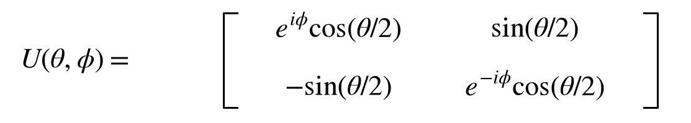
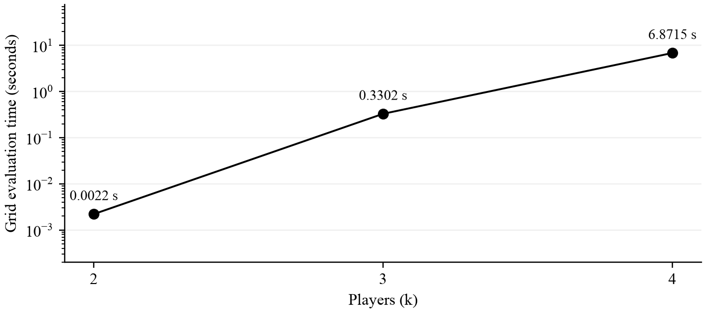
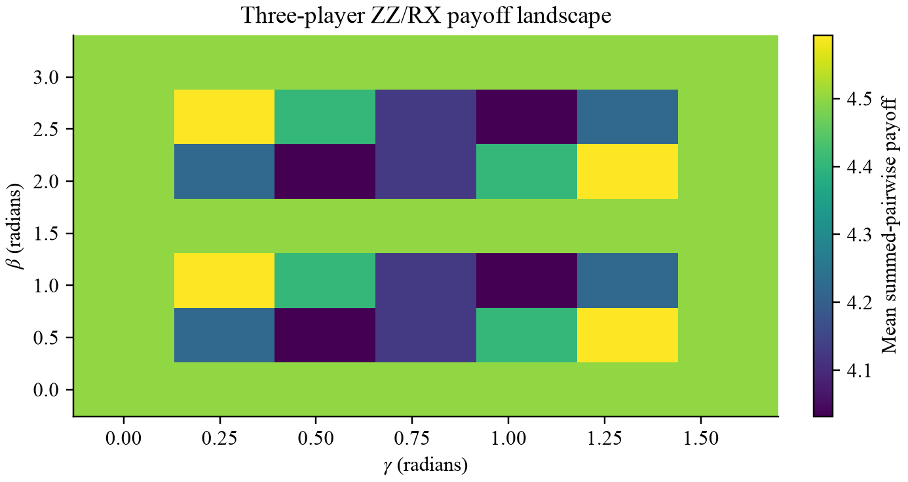
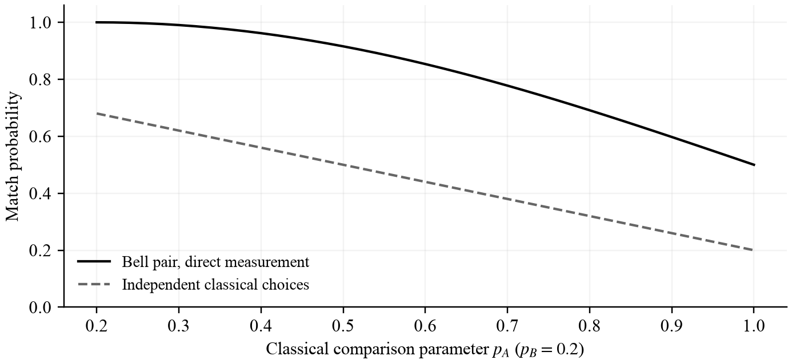

# Simulating Game Theory and Strategic Interactions Using Quantum Computing

Esther Cui

Revised computational manuscript | 3 October 2026

## 1 Abstract

This study examines how quantum strategies change classical game-theory incentives, such as the cooperation breakdown in multiplayer Prisoner's Dilemma, and support Nash equilibria unavailable in the classical action game. Using a QAOA-style variational circuit and entangled Eisert-Wilkens-Lewenstein (EWL) circuits with an explicit all-pairs extension, we simulate two- to four-player PD and show that variational optimization increases expected payoff relative to matched classical Nash baselines, while EWL circuits support cooperative Q equilibria at k = 2, 3, and 4, where the corresponding classical action game predicts universal defection. Our four-player EWL grid sweep evaluates approximately 19 million profiles and identifies cooperative and asymmetric equilibria. In the Schelling Point Game, shared Bell states increase ideal coordination from 50% for independent uniform choices to 100% under equal local rotations. Although quantum strategies expand the available actions, these results are obtained through classical statevector simulation and do not establish a computational speedup. Building on prior work (e.g., Eisert et al.), this study expands the Nash search to a specified multiplayer model, records simulation runtime, and explores coordination models motivated by trade, logistics, and distributed systems.

## 2 Introduction

### 2.1 Background and Motivation

Game theory, a foundation of economics and strategic decision-making, studies how rational units - people, companies, nations, even software bots - make decisions when the outcome depends on the choices of all. From Cold War deterrence to modern trade policy and automated negotiation algorithms, it underpins some of the most complex decisions in human history.

In the classical Prisoner's Dilemma, rational players defect even though mutual cooperation would benefit all. In coordination games such as the Schelling Point model, independent random choices can fail to align. Such models motivate questions about incentives and coordination in trade, disaster response, and distributed systems, while remaining abstractions of those settings.

Quantum game theory, including the EWL construction [1] and multiplayer quantum games [2], changes the available operations and shared resources. This paper explores PD to study incentives under an expanded strategy space and the Schelling Point game to study coordination with shared quantum states. Simulations extend through four PD players, with explicit model definitions, payoff conventions, and unilateral-deviation tests.

### 2.2 Gaps in Literature

The contribution is a reproducible small-system study connecting circuit definitions, strategy grids, and equilibrium certificates. Two-player EWL results motivate an explicit all-pairs extension, whose multiplayer behavior is evaluated directly. The study also separates optimization of aggregate payoff from individual-player Nash stability, and independent classical coordination from protocols using shared resources. It makes no priority claim about the largest simulation and does not infer hardware feasibility from ideal gate counts alone.

### 2.3 Research Question and Hypothesis

Prisoner's Dilemma research question: Can quantum computing techniques - specifically QAOA-style and entangled circuit models - simulate multiplayer strategic dilemmas more efficiently than classical methods, and do these models predict different Nash equilibria from the classical action game?

Hypothesis: An expanded quantum strategy space may support equilibria with different incentives and payoffs from classical C/D play. Computational speedup is a separate hypothesis that the present classical simulations do not establish.

Schelling Point Game research question: To what extent does quantum entanglement improve coordination compared with independent classical random play, and how does coordination change when local rotations differ?

Hypothesis: Shared Bell states preserve matching under equal real rotations, while unequal rotations reduce the match probability. This comparison specifies independent classical choices as its baseline; shared classical randomness is a separate resource.

## 3 Methodology

### 3.1 Prisoner's Dilemma

We analyze PD with three techniques: classical enumeration, variational payoff optimization, and EWL strategy search. A pure strategy is one fixed action or unitary choice. Probabilistic quantum measurement does not make a fixed unitary a mixed strategy over unitaries.

The two-player payoffs use cooperation C = 0 and defection D = 1:

| Player 0 / Player 1 | C | D |
|---|---|---|
| C | (3, 3) | (0, 5) |
| D | (5, 0) | (1, 1) |

For the Nash study, the collective multiplayer rule pays every player 3 at all-C and 1 at all-D; at any other measured action profile, defectors receive 5 and cooperators receive 0. The classical baseline uses this same rule. For the variational study, each player instead sums the two-player payoff over k - 1 opponents, matching the original variational experiment. Its classical Nash baseline is k - 1 per player. Payoffs from these two multiplayer games are reported separately.

(I) Classical enumeration exhaustively checks all 2^k action profiles under the selected payoff rule. All-D is the unique classical pure equilibrium for both rules, paying 1 collectively or k - 1 with summed pairwise payoffs.

(II) Depth-one variational optimization retains the original QAOA-style circuit [3,4]: H on every qubit, a uniform ZZ layer on every pair, then RX mixing. The gates are CX-RZ(2 γ)-CX for each pair and RX(2 β) on each qubit. COBYLA minimizes the negative sum of player payoffs, starting at (0.5, 0.5) for k = 2 and (0.7, 1.0) for k = 3,4, with at most 100 evaluations. The revised runs use exact statevector expectations. They report attained local optimizer values, not certified global optima or Nash equilibria. The ZZ/RX circuit is a payoff ansatz; it is not asserted to encode the complete PD cost Hamiltonian, whose pairwise aggregate payoff also contains linear Z terms.

(III) The EWL search uses the restricted two-angle strategy family of [1]. For k > 2, the interaction below defines the particular all-pairs extension studied here; multiplayer quantum games admit other choices [2].

### 3.1.1 EWL Grid Sweep

Each player applies the following unitary, with θ in [0, π] and φ in [0, π/2]:



The named strategies are C = U(0,0) = I, D = U(π,0) = iY, and Q = U(0,π/2) = iZ. The initial state is the all-zero computational basis state. The protocol applies J, then each local strategy, then the inverse J before measurement:

```math
J_k=\prod_{i<j}\exp(-i\gamma D_iD_j/2),\qquad \gamma=\pi/2.
```

```math
|\psi_f\rangle=J_k^{\dagger}(U_0\otimes\cdots\otimes U_{k-1})J_k|0\rangle^{\otimes k}.
```

Tensor factors in this equation are ordered by player. Stored statevectors use little-endian qubit order: player i controls qubit i and receives the payoff for bit (x >> i) & 1 at basis index x [5]. A gate implementation uses RYY(-γ) on every pair for J, then RZ(-φ), RY(-θ), RZ(-φ) on each player's qubit, followed by the inverse pair gates. NumPy matrices and independently assembled Qiskit circuits are compared in the tests.

The endpoint-inclusive grids retain 15 θ values and 8 φ values for k = 2,3, and 11 θ values and 6 φ values for k = 4. Every joint angle profile is evaluated, including every phase value. Batching controls temporary memory without reducing the strategy space. A grid profile qualifies when each player's best grid deviation improves their expected payoff by at most 10^-3. All tied best responses are retained.

Each candidate then receives a continuous unilateral-deviation certificate. Write U = aI + bD + cQ, where a = cos(θ/2)cos(φ), b = sin(θ/2), c = cos(θ/2)sin(φ), and a,b,c are nonnegative with a^2+b^2+c^2 = 1. Holding opponents fixed makes expected payoff a real 3-by-3 quadratic form. Enumerating its eigenvectors on the seven nonempty coordinate faces finds the maximum over the allowed continuous family; Appendix B explains the method. Counts are also checked at tolerance 10^-10. This certifies returned candidates but does not enumerate all off-grid equilibria.

### 3.1.2 Evaluation Metrics

We report expected payoff in player order, the expected fraction of measured C outcomes, the payoff difference from a classical Nash baseline using the same rule, full angle-profile counts, and per-player maximum unilateral gain (regret). Grid equilibrium frequency means qualifying angle profiles divided by all evaluated angle profiles; it is not an experimental probability of reaching equilibrium. Timing and gate counts identify their circuit and execution convention.

### 3.1.3 Experimental Setup

The revised computations use Python 3.12.14, NumPy 2.5.3, Qiskit 2.5.2, and SciPy 1.18.1, with package versions pinned in uv.lock. All reported revised probabilities and payoffs are exact statevector expectations evaluated in floating-point arithmetic, with no finite-shot sampling or noise model. Full EWL grids were evaluated locally on an Apple M5 Max host with 18 CPU cores and 64 GiB memory, with numerical-library thread limits set to one and no worker pool. Recorded timings describe these runs only. No QPU, cloud timing comparison, or hardware speedup is measured.

### 3.2 Schelling Point Game

This is a two-agent pure coordination game in which each player selects a location from a fixed menu. The study tests two and four locations. Payoff is 1 when both players' strings are identical and 0 otherwise, so expected payoff equals the match probability. The comparison is between specified shared-state protocols and independent classical choices; shared classical randomness can also achieve perfect matching.

### 3.2.1 Quantum Version

For two locations, prepare a Bell pair by applying H to qubit 0 and then CX(0,1). Each player applies a real RY rotation. Equal rotations include theta_A = theta_B = 0 or π/6; unequal examples are (π/6,0) and (π/2,0). Direct computational-basis measurements have matching probability

```math
P_{\rm match}=\cos^2((\theta_A-\theta_B)/2).
```

A separate inverse variant applies CX(0,1) and H(0) after the local rotations and before measurement. This includes a joint two-qubit operation and gives match probability 1 for this rotation family. Different local rotations change the measured correlations; local unitaries do not themselves destroy the entanglement of an ideal Bell pair. The four-location protocol uses two Bell pairs and compares each player's two-bit register.

### 3.2.2 Classical Baseline

Each player chooses Left with independent probabilities p_A and p_B. The match probability is

```math
P_{\rm match}=p_Ap_B+(1-p_A)(1-p_B).
```

Uniform independent choices among four locations match with probability 1/4. The classical probabilities and quantum rotation angles are distinct parameters, and comparisons below do not assume equal local marginals.

### 3.2.3 Evaluation Metrics

We report exact match probabilities and the difference between specified quantum and independent classical protocols. Unit operations and CX gates are counted before transpilation, with measurements reported separately. A gate count alone does not quantify physical fidelity or communication cost.

### 3.2.4 Experimental Setup

Revised coordination results use Qiskit statevectors with no shots. For the continuous comparison curve, p_B = 0.2, p_A ranges from 0.2 to 1, and the angle difference is |p_A-p_B| π / 1.6. This curve mapping is stated separately from the illustrative table pairings. Source code, parameter values, and result artifacts are available in Appendix A.

### 3.2.5 Experiments

Table 1 defines each comparison. A shared quantum rotation leaves the local measurement marginals unbiased; it is therefore labeled a shared rotation rather than identified with a classical bias probability.

| Configuration | Classical pA, pB | Quantum angles / state |
| --- | --- | --- |
| Two, unbiased | 0.5, 0.5 | 0, 0 |
| Two, shared rotation A | 0.7, 0.7 | pi/6, pi/6 |
| Two, shared rotation B | 0.9, 0.9 | pi/6, pi/6 |
| Two, unequal rotations | 0.8, 0.2 | pi/6, 0 |
| Two, pi/2 difference | Not paired | pi/2, 0 |
| Four, unbiased | Uniform independent | Two Bell pairs |

Table 1. Classical probability settings and quantum rotation settings for the coordination experiments.

## 4 Results

### 4.1 Prisoner's Dilemma

### 4.1.1 Quantitative Outcomes

The retained grids contain 1, 1, 433 equilibrium angle profiles for k = 2, 3, and 4, respectively.

| k | Grid / player | Joint profiles | Grid NE | Continuous certified | All-Q payoff |
| --- | --- | --- | --- | --- | --- |
| 2 | 15 x 8 | 14,400 | 1 | 1 | 3 each |
| 3 | 15 x 8 | 1,728,000 | 1 | 1 | 3 each |
| 4 | 11 x 6 | 18,974,736 | 433 | 433 | 3 each |

Table 2a. Collective-payoff Nash results. The all-Q profile pays 3 to every player and has zero unilateral improvement, to numerical precision, for each k. Every returned grid candidate also passes the continuous check at 10^-10. Counts refer to the specified grid, not to the total number of equilibria in the continuous strategy space.

For k = 2, Q against D pays (5,0), while C against D pays (0,5). Q,Q is the cooperative-payoff Nash profile. C,C is not Nash: a unilateral D earns 5 rather than 3. The same distinction between a strategy and its measured outcome applies to the multiplayer study.

For all-Q, a deviator's collective payoff has a simple form. With the coefficients a,b,c defined above, it is 3c^2+a^2 for even k and 3c^2+b^2 for odd k; both are at most 3. Consequently, all-Q is stable for k = 2,3,4. A unilateral D against Q players receives 0, 1, 0, respectively. Parity changes this deviation payoff but does not eliminate the cooperative Q equilibrium at k = 3.

At k = 4, 1 grid profile is all-Q. The other 432 profiles are permutations of (C, U(π/2,π/2), D, D), including the six redundant φ labels for each D. They pay 5 to the U(π/2,π/2) player and 2.5 to each other player. Removing those identical D parameterizations leaves 12 asymmetric profiles plus all-Q, or 13 in total. These are pure unitary strategies with probabilistic outcomes. The existence of all-Q does not imply selection or uniqueness of cooperative play.

The continuous three-player strategy space contains equilibria that the 15-by-8 grid does not sample. As a direct check, all players using U(0,π/4) receive 3.25 each and pass the same continuous response certificate. This profile is outside the phase grid and is not included in the grid count in Table 2a.

The local variational runs attain mean payoffs of 2.5000, 4.6667, 6.7500 for k = 2, 3, and 4, respectively.

| k | Mean payoff | Matched baseline | Gain | C fraction | CX gates |
| --- | --- | --- | --- | --- | --- |
| 2 | 2.5000 | 1 | 1.5000 | 50% | 2 |
| 3 | 4.6667 | 2 | 2.6667 | 50% | 6 |
| 4 | 6.7500 | 3 | 3.7500 | 50% | 12 |

Table 2b. Attained local variational results under summed pairwise payoffs. All COBYLA runs terminate successfully with their original initial points and a 100-evaluation cap. The baseline is k - 1, so the gains are 1.5000, 2.6667, 3.7500. The expected C fraction is 50% at every reported parameter point, consistent with the ansatz's global bit-flip symmetry. These values characterize payoff optimization, not equilibrium frequency or a computational speedup.

### 4.1.2 Runtime Scaling



Figure 1. Measured payoff-tensor construction time for each original grid size, on the host specified in section 3.1.3. The times are 0.0022, 0.3302, 6.8715 seconds for k = 2,3,4. They exclude the subsequent candidate-certificate stage. Every one of the 18,974,736 four-player angle profiles is evaluated. Batched NumPy operations and small statevectors make these CPU computations practical. The three grids have different resolutions, and these isolated runs do not establish an asymptotic scaling law or a controlled speedup over historical implementations.

### 4.1.3 Variational Payoff Landscape (k = 3)



Figure 2. Exact mean summed-pairwise payoff over the original 7-by-7 γ/β domain: γ in [0,π/2] and β in [0,π]. The grid maximum is 4.59375, or 2.59375 above the matched classical Nash payoff of 2. This finite landscape and the separate local COBYLA run answer different numerical questions; neither supplies a Nash certificate.

### 4.2 Schelling Point Game

### 4.2.1 Quantitative Outcomes

| Configuration | Classical | Direct quantum | With inverse | Delta |
| --- | --- | --- | --- | --- |
| Two, unbiased | 0.500000 | 1.000000 | 1.000000 | +0.500000 |
| Two, shared rotation A | 0.580000 | 1.000000 | 1.000000 | +0.420000 |
| Two, shared rotation B | 0.820000 | 1.000000 | 1.000000 | +0.180000 |
| Two, unequal rotations | 0.320000 | 0.933013 | 1.000000 | +0.613013 |
| Two, pi/2 difference | - | 0.500000 | 1.000000 | - |
| Four, unbiased | 0.250000 | 1.000000 | 1.000000 | +0.750000 |

Table 3. Exact coordination expectations for the configurations in Table 1. Delta compares direct quantum measurements with the specified independent classical choices. The dash marks a row without a paired classical distribution. The inverse protocol gives 1 throughout these examples, but includes joint processing before measurement. The illustrative classical and quantum bias settings are not identified as the same marginal distribution.

### 4.2.2 Coordination Curve



Figure 3. With the mapping in section 3.2.4, the direct Bell-pair match probability falls from 1 to 0.5 while the independent classical match probability falls from 0.68 to 0.2. Thus the curves do not meet at the endpoint. At a quantum angle difference of π/6, the exact match probability is 0.9330127.

### 4.2.3 Observations and Interpretations

The unbiased Bell-pair protocol gives match probability 1, compared with 0.5 for two uniform independent classical choices. Equal real rotations preserve perfect matching. At angle differences π/6 and π/2, direct quantum matching becomes 0.9330127 and 0.5, respectively. Uniform independent choices among four spots match with probability 0.25, while the two-Bell-pair protocol matches with probability 1.

The four-spot circuit before optional inversion contains two H gates and two CX gates, followed by four measurements. Including the inverse gives eight unitary operations, of which four are CX, plus four measurements. These ideal circuits provide a compact test bed for coordination; no noisy-device success probability is inferred. Shared classical randomness is capable of perfect matching as well, so the reported improvement is specifically relative to independent choices.

## 5 Future Work and Limitations

### 5.1 Prisoner's Dilemma

Grid resolution and computational cost remain a trade-off. The current four-player grid contains 18,974,736 profiles, while a 31-by-16 grid contains 60,523,872,256 profiles. Efficient batching changes implementation cost but not this combinatorial count. Adaptive sampling and tensor methods are possible future approaches whose accuracy and runtime would need measurement.

The study restricts each player's unitary to a two-parameter family and excludes mixed distributions over those unitaries. A certificate verifies all unilateral deviations within that family for a returned profile; it does not establish uniqueness in the continuous space or stability under general quantum operations. The all-pairs entangler and collective payoff rule are explicit modeling choices, so different multiplayer games need their own analysis. The off-grid three-player example demonstrates that grid resolution affects enumeration even when each reported candidate is continuously stable.

The variational study retains a fixed depth-one ansatz and one local optimizer start per player count. It does not establish a global maximum. Future work could compare additional starts, full cost-Hamiltonian constructions, and noisy sampling under matched payoff rules. Runtime or hardware-advantage claims require controlled benchmarks beyond the present CPU simulations.

### 5.2 Schelling Point Game

The Schelling study is limited to two agents and two or four locations. Extending the number of players requires an explicit state-distribution and measurement protocol; its resource costs and noise sensitivity are separate questions. Real focal points also involve cultural priors and unequal values assigned to locations. Future models can use nonuniform payoff matrices and empirical priors, while comparing independent randomness, shared classical randomness, and shared quantum states under stated communication constraints.

## 6 Impact and Significance

### 6.1 Prisoner's Dilemma

The simulations provide an accessible way to examine how a change in allowed strategies affects unilateral incentives. Cooperative Q equilibria survive at two, three, and four players in the specified model, while additional equilibria show that stable behavior need not be uniquely cooperative. Trade diplomacy, carbon-credit markets, and disaster logistics remain possible motivations for future modeling. The current experiments do not model their institutions, enforcement, losses, or communications, so they do not quantify lives saved, avoided transaction costs, or the effect of adding particular negotiating parties.

### 6.2 Schelling Point Game

The coordination experiments illustrate the role of shared resources and local measurement choices. Applications to distributed reporting, liquidity allocation, or network coordination would require separate adversarial, economic, and communication models. Ideal Bell-pair matching does not establish corruption thresholds, transaction fees, blockchain finality, or liquidity savings. The immediate contribution is a small, reproducible experimental setting for studying coordination assumptions.

## 7 Conclusion

This research compares classical action games, a variational payoff ansatz, and an explicit all-pairs EWL extension for small multiplayer systems. The restricted quantum strategy space supports all-Q Nash equilibria with cooperative payoff 3 for k = 2,3,4 under the collective rule. The four-player grid also contains asymmetric stable profiles, and an off-grid three-player example confirms that finite enumeration is not a complete classification of continuous equilibria.

The QAOA-style ansatz attains increased summed-pairwise payoffs relative to matched classical Nash baselines, while the Schelling protocols show exact coordination behavior under specified shared-state resources and rotations. These findings distinguish changes in strategic opportunities from computational speedup and practical deployment claims. The accompanying code, parameter grids, result files, and continuous-deviation certificates make the reported calculations reproducible.

## 8 References

[1] Eisert, J., Wilkens, M., and Lewenstein, M. (1999). Quantum games and quantum strategies. Physical Review Letters, 83, 3077-3080. https://doi.org/10.1103/PhysRevLett.83.3077. Equations follow the corrected entangler sign in arXiv:quant-ph/9806088v4.

[2] Benjamin, S. C., and Hayden, P. M. (2001). Multiplayer quantum games. Physical Review A, 64, 030301. https://doi.org/10.1103/PhysRevA.64.030301.

[3] Farhi, E., Goldstone, J., and Gutmann, S. (2014). A quantum approximate optimization algorithm. arXiv:1411.4028. https://arxiv.org/abs/1411.4028.

[4] Hadfield, S., Wang, Z., O'Gorman, B., Rieffel, E. G., Venturelli, D., and Biswas, R. (2019). From the Quantum Approximate Optimization Algorithm to a Quantum Alternating Operator Ansatz. Algorithms, 12(2), 34. https://doi.org/10.3390/a12020034.

[5] IBM Quantum. Qiskit documentation: bit ordering and RYYGate. https://quantum.cloud.ibm.com/docs/en/guides/bit-ordering and https://quantum.cloud.ibm.com/docs/en/api/qiskit/qiskit.circuit.library.RYYGate. Accessed 3 October 2026.

[6] Cui, E. Quantum Game Simulations: source, notebooks, result artifacts, and revised manuscript. https://github.com/Esthercui/quantum/tree/polish/reproducible-nash. Computational revision, October 2026.

## Appendix A: Code Availability and Reproduction

The repository [6] contains the source and all numerical artifacts used in this revision. The EWL implementation is src/quantum_pd/ewl.py; full-grid evaluation and continuous responses are in ewl_search.py. The variational and Schelling circuits are in experiments.py. Results are stored in results/ewl-k2.json, results/ewl-k3.json, results/ewl-k4.json, results/optimization.json, and results/experiments.json. Each EWL record includes its exact angles, payoffs, best-response angles, regrets, and scientific-source hashes.

Install the pinned environment with uv sync --frozen --all-extras. Run scripts/reproduce_research.py for the full original EWL grids, scripts/reproduce_optimization.py for the retained COBYLA settings, and scripts/reproduce_experiments.py for the payoff landscape and coordination examples. scripts/verify_research.py --full rechecks the grid enumeration and continuous certificates. The manuscript tables and numerical substitutions are generated from these result files; the manuscript build check detects stale numerical text.

Original notebooks remain in the source archive. The separate ZZ benchmark has an explicit circuit name and is not used for this manuscript's EWL tables. Numerical certification is limited by floating-point precision and the declared tolerance.

## Appendix B: Continuous Unilateral Best Responses

Fix every player's strategy except one. For that player, U = aI+bD+cQ, with nonnegative a,b,c and a^2+b^2+c^2 = 1, parameterizes the entire allowed angle domain. Linearity gives a final state a|v_I>+b|v_D>+c|v_Q>. If W is the diagonal matrix of that player's classical outcome payoffs, define the real symmetric matrix H by H_rs = Re(<v_r|W|v_s>). Expected payoff is x^T H x for x = (a,b,c).

On any face with a fixed nonempty support, a stationary point on the unit sphere is an eigenvector of the corresponding principal submatrix. Enumerating all seven supports, all eigenvectors, and both signs retains the nonnegative candidates. The global maximum must be among these candidates or on a smaller face, which is also enumerated. If an eigenvalue is repeated, a feasible maximizing eigenspace can reach a smaller coordinate face with the same value, so degeneracy does not remove the maximum from the enumeration. The implementation normalizes feasible vectors and converts the maximizing coefficients back to angles using θ = 2 atan2(b, sqrt(a^2+c^2)) and φ = atan2(c,a).

Tests compare this response value with the payoff attained by its returned angles and with dense sampled deviations, including degenerate cases. Independent Qiskit tests check the underlying circuit for each player count and several entanglement strengths. The saved certificates give the largest continuous regret for every returned grid profile.
